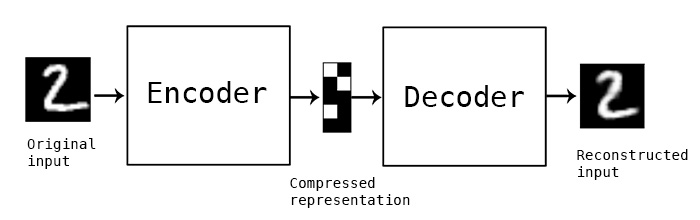

## Samarth Ganesh Thopaiah ~ November 2022

# A Simple AutoEncoder for images in the MNIST DATASET 

The learning capability of the simplest autoencoder is explored in this work. We see if the self-supervised autoencoder can accurately learn to reconstruct the MNIST digits. 

### Useful parameters to consider tuning in this simple autoencoder 
- Model Architecture: In this case we pick Multi-Layer Perceptrons of size [784, 128, 32 (latent representation size)] for the encoder and symmetrically for decoder. 
- Learning rate scheduler : REDUCELRONPLATEAU with default factor and patience; 
- Optimizer : Adaptive momentum with default betas and LR of 0.001

## Reconstruction results 
- Original 

-Reconstructed 
